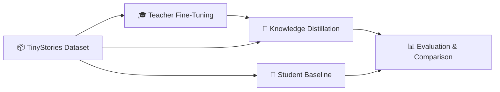

<div align="center">

# 🧠 Knowledge Distillation for Lightweight Generative Language Models

**Compressing GPT-2 into a 7.7x smaller student model while preserving generative language capabilities**

[](https://python.org)
[](https://pytorch.org)
[](https://huggingface.co)
[](https://huggingface.co/datasets/roneneldan/TinyStories)
[](./LICENSE)

---

> 📝 **Research Question:** Can knowledge distillation preserve generative language modeling capabilities in highly compressed transformer architectures suitable for edge or mobile deployment?

</div>

---

## 📖 Overview

This project investigates whether **knowledge distillation** can compress transformer-based generative language models while preserving important language generation capabilities. Unlike simple classification tasks, this project targets genuine generative transformer behavior including grammar, syntax, semantic understanding, contextual coherence, and next-token prediction.

The focus is on autoregressive language modeling using the [TinyStories](https://huggingface.co/datasets/roneneldan/TinyStories) dataset — a synthetic corpus specifically designed for training and evaluating small language models.

### 💡 Motivation

Modern large language models achieve impressive text generation but require:

| Challenge | Impact |
|---|---|
| 💾 Enormous memory | Cannot deploy on edge devices |
| 💰 Expensive GPUs | High infrastructure cost |
| ⚡ High inference cost | Slow response times |
| 🌍 Large energy consumption | Environmental concerns |

This project shows that smaller transformer models can inherit generative capabilities from larger teacher models through knowledge distillation — enabling efficient AI for edge and mobile deployment.

---

## 🛠️ Built With

| Component | Technology | Purpose |
|---|---|---|
| Framework | PyTorch 2.0+ | Full control over custom distillation training loop |
| Models | Hugging Face Transformers | Pretrained GPT-2, tokenizer, GPT2Config |
| Dataset | Hugging Face Datasets | TinyStories loading with memory-mapped Arrow |
| Training | AMP (Mixed Precision) | 2x memory savings, FP16 training |
| Hardware | AMD ROCm / NVIDIA CUDA | Single consumer GPU (8 GB+ VRAM) |

---

## 📚 The TinyStories Dataset

[TinyStories](https://huggingface.co/datasets/roneneldan/TinyStories) is a synthetic language modeling dataset created by Microsoft Research (Eldan & Li, 2023). It was specifically designed so that small language models (even < 10M parameters) can learn meaningful grammar, reasoning, and narrative structure.

| Property | Value |
|---|---|
| Total stories | ~2.1 million |
| Split used (train) | 30,000 samples (subset for pilot) |
| Split used (val) | 1,000 samples |
| Vocabulary | Controlled, age-appropriate English |
| Avg. story length | ~150–300 tokens |
| Source | GPT-3.5/4 generated with controlled prompts |

### 📝 Dataset Examples

Stories in TinyStories follow simple narrative patterns with clear grammar and coherent structure:

> **Example 1:**
> *"Once upon a time, there was a little girl named Lily. She loved to play outside in the sunshine. One day, she found a pretty flower in the garden. She picked it up and showed it to her mom. Her mom smiled and said it was beautiful."*

> **Example 2:**
> *"Tom had a big red ball. He liked to throw it high in the sky. One day, the ball went over the fence. Tom was sad. His dad helped him get the ball back. Tom was happy again."*

> **Example 3:**
> *"There was a cat named Whiskers. Whiskers liked to sleep on the soft bed. One morning, Whiskers heard a bird outside. He jumped to the window and watched. The bird flew away and Whiskers went back to sleep."*

### Why TinyStories for Distillation?

- ✅ Large models (GPT-2) excel on this data, small models visibly degrade → **distillation improvements are measurable**
- ✅ Controlled complexity enables clear observation of compression effects
- ✅ Consumer hardware is sufficient for training
- ✅ Published research demonstrates sub-10M models can learn from it

---

## 🏗️ Architecture

### Teacher Model — GPT-2 Small (124M)

| Property | Value |
|---|---|
| Architecture | Decoder-only Transformer |
| Parameters | **~124M** |
| Layers | 12 |
| Hidden Size | 768 |
| Attention Heads | 12 |
| Context Length | 1024 |
| FP32 Size | ~500 MB |
| Source | OpenAI pretrained, fine-tuned on TinyStories |

### Student Model — Lightweight Decoder Transformer (~16M)

| Property | Value |
|---|---|
| Architecture | GPT2LMHeadModel (custom config) |
| Parameters | **~16.2M** |
| Layers | 4 |
| Hidden Size | 256 |
| Attention Heads | 4 |
| Context Length | 512 |
| FP32 Size | ~61.6 MB |
| Compression | **7.7x fewer parameters** |

### Why These Architectures?

- Same tokenizer (GPT-2 BPE, 50257 vocab) for both → compatible logit shapes
- Same model family → clean distillation without dimension adapters
- 4 layers minimum for capturing multi-level language patterns
- Hidden size 256 with 4 heads → 64-dim per head (proven effective)

---

## 🔬 Distillation Pipeline



### Stage 1: Teacher Fine-Tuning

Fine-tune pretrained GPT-2 Small on 30k TinyStories examples (1 epoch). The teacher learns the domain-specific distribution and serves as the knowledge source.

### Stage 2: Student Baseline

Train the student model from scratch with standard cross-entropy loss only. This establishes the baseline for what the small architecture can learn without teacher guidance.

### Stage 3: Knowledge Distillation

Train the student using a combined loss that leverages both ground truth tokens and the teacher's soft probability distributions:

$$L = \alpha \cdot T^2 \cdot \text{KL}(p_{\text{teacher}} \| p_{\text{student}}) + (1 - \alpha) \cdot L_{\text{CE}}$$

| Symbol | Meaning |
|---|---|
| $T$ | Temperature for softening distributions |
| $\alpha$ | Weight for distillation loss (KL divergence) |
| $(1 - \alpha)$ | Weight for standard cross-entropy loss |
| $p_{\text{teacher}}$ | Teacher's softmax distribution at temperature $T$ |
| $p_{\text{student}}$ | Student's softmax distribution at temperature $T$ |
| $T^2$ | Gradient magnitude compensation |

The temperature $T$ softens the teacher's output distribution, revealing "dark knowledge" — the relationships between tokens that the teacher has learned (e.g., that "cat" and "dog" are more related than "cat" and "table").

---

## 📊 Experiment Results

### 🏆 Student Model Comparison

All models evaluated on the same 1,000-sample TinyStories validation subset with seed 42:

| Model | Configuration | Loss | Perplexity | Δ vs Baseline |
|---|---|---:|---:|---|
| Student Baseline | CE only | 2.6797 | 14.58 | — |
| Distilled (initial) | T=2.0, α=0.5, lr=5e-4 | 2.7596 | 15.79 | ❌ +8.3% worse |
| Distilled (tuned) | T=1.5, α=0.3, lr=2e-4 | 2.6268 | 13.83 | ✅ -5.1% better |
| **Distilled (best)** | **T=1.5, α=0.2, lr=3e-4** | **2.4668** | **11.78** | ✅ **-19.2% better** |

> 💡 **Key Finding:** Conservative teacher weighting (α=0.2) with moderate temperature (T=1.5) outperforms aggressive distillation. Equal CE/KL weighting actually performed *worse* than the baseline.

### 🌡️ Temperature Sweep Results

Systematic sweep across 8 temperatures (α=0.3, lr=2e-4, 3 epochs each):

| Temperature | Epoch 1 | Epoch 2 | Epoch 3 | Final Perplexity | Rank |
|---:|---:|---:|---:|---:|---|
| 0.75 | 3.4919 | 2.9461 | 2.6767 | 14.50 | 4th |
| 1.00 | 3.2657 | 2.7859 | 2.5247 | 12.46 | 2nd |
| **1.25** | **3.3357** | **2.7876** | **2.5208** | **12.41** | **🥇 1st** |
| 1.50 | 3.4870 | 2.9188 | 2.6358 | 13.93 | 3rd |
| 1.75 | 3.6938 | 3.0244 | 2.7217 | 15.18 | 5th |
| 2.00 | 3.8618 | 3.1546 | 2.8186 | 16.73 | 6th |
| 2.50 | 4.1977 | 3.4143 | 3.0267 | 20.60 | 7th |
| 3.00 | 4.3869 | 3.5836 | 3.1320 | 22.86 | 8th |

> 📈 **Takeaway:** Lower temperatures (1.0–1.25) clearly outperform higher ones. Results degrade steadily from T=1.5 onward. The "conventional wisdom" of T=2–5 does not hold for this generative task.

### 📋 All Tried Configurations Summary

| # | Temperature | Alpha | Learning Rate | Epochs | Perplexity | Status |
|---:|---:|---:|---:|---:|---:|---|
| 1 | 2.0 | 0.5 | 5e-4 | 3 | 15.79 | ❌ Worse than baseline |
| 2 | 1.5 | 0.3 | 2e-4 | 3 | 13.83 | ✅ Moderate improvement |
| 3 | 1.5 | 0.2 | 3e-4 | 3 | 11.78 | ✅ **Best overall** |
| 4 | 0.75 | 0.3 | 2e-4 | 3 | 14.50 | ⚠️ Near baseline |
| 5 | 1.0 | 0.3 | 2e-4 | 3 | 12.46 | ✅ Strong |
| 6 | 1.25 | 0.3 | 2e-4 | 3 | 12.41 | ✅ Best sweep run |
| 7 | 1.75 | 0.3 | 2e-4 | 3 | 15.18 | ❌ Worse than baseline |
| 8 | 2.0 | 0.3 | 2e-4 | 3 | 16.73 | ❌ Clearly worse |
| 9 | 2.5 | 0.3 | 2e-4 | 3 | 20.60 | ❌ Degraded |
| 10 | 3.0 | 0.3 | 2e-4 | 3 | 22.86 | ❌ Strongly degraded |

### Compression Results

| Metric | Teacher (GPT-2) | Student | Ratio |
|---|---:|---:|---|
| Parameters | 124M | 16.2M | **7.7x smaller** |
| Model Size (FP32) | ~500 MB | 61.6 MB | **8.1x smaller** |
| Layers | 12 | 4 | 3x fewer |
| Hidden Size | 768 | 256 | 3x narrower |

---

## 📖 Generation Samples

Qualitative comparison of text generated by the different student models (prompt → continuation):

### Prompt: *"Once upon a time"*

<table>
<tr><th>Model</th><th>Generated Text</th></tr>
<tr>
<td><b>Baseline</b><br>(Perplexity: 14.58)</td>
<td><em>Once upon a time, there was a little girl named Lily. She loved to play outside and play. One day, she saw a big hole in the ground. The rock was very shiny and pretty. Lily wanted to go to the tree with her toys. The next day, she saw a big tree. She wanted to play with the rock, but she didn't want to be lost.</em></td>
</tr>
<tr>
<td><b>Distilled Best</b><br>(Perplexity: 11.78)</td>
<td><em>Once upon a time, there was a little boy named Timmy. Timmy had a big big box that he liked to play with. One day, Timmy's mom told him, "That's a good thing to help you. If you help me open the box, you can help me." Timmy felt better. He decided to ask his mommy, "Mommy, can we make a</em></td>
</tr>
</table>

### Prompt: *"She was very happy"*

<table>
<tr><th>Model</th><th>Generated Text</th></tr>
<tr>
<td><b>Baseline</b><br>(Perplexity: 14.58)</td>
<td><em>She was very happy because it was raining. She was very sad because it was hard for her mom and not for dinner. At the end, she asked her mom for dinner, but she couldn't see it. Her mom was happy to see the candy and started to argue.</em></td>
</tr>
<tr>
<td><b>Distilled Best</b><br>(Perplexity: 11.78)</td>
<td><em>She was very happy, but she was nervous. She was going to the park to see the big slide. She wanted to go on the slide, but she was nervous. She was so excited to see the slide. She climbed up and reached the top. She watched the slide slide. She was so excited she could hear her mom come.</em></td>
</tr>
</table>

> 🔍 **Observation:** The distilled model produces more coherent narratives with better dialogue structure and logical flow compared to the baseline, which sometimes contradicts itself or loses context.

---

## 📂 Repository Structure

```
distillation_generative_llm/
├── 📁 data/                          # Dataset storage (HuggingFace Arrow format)
│   ├── train/                        # 30k training samples
│   └── validation/                   # 1k validation samples
├── 📁 notebooks/                     # Jupyter notebooks for exploration
│   └── 01_eda_tinystories.ipynb      # Exploratory data analysis
├── 📁 outputs/                       # Model checkpoints & training logs
│   ├── logs/                         # Timestamped training logs
│   └── config_sweeps/                # Sweep results with configs + checkpoints
├── 📁 reports/                       # Generated evaluation reports (JSON + MD)
├── 📁 scripts/                       # Executable training & evaluation scripts
│   ├── train.py                      # Single model training
│   ├── train_all.py                  # Full pipeline (teacher → baseline → distill)
│   ├── compare_students.py           # Multi-checkpoint comparison
│   ├── run_config_sweep.py           # Temperature/hyperparameter sweeps
│   ├── evaluate.py                   # Evaluation utilities
│   ├── download_data.py              # Dataset download helper
│   └── verify_setup.py              # Environment verification
├── 📁 src/                           # Core library code
│   ├── data/                         # Dataset loading & tokenization
│   │   ├── dataset.py                # DataLoader factory
│   │   └── tokenizer.py             # GPT-2 BPE tokenizer wrapper
│   ├── models/                       # Model definitions
│   │   ├── teacher.py                # GPT-2 Small wrapper
│   │   └── student.py               # Lightweight 4-layer student
│   ├── training/                     # Training loops
│   │   ├── trainer.py                # Standard CE trainer
│   │   └── distillation.py          # KD trainer with combined loss
│   ├── evaluation/                   # Metrics computation
│   │   └── metrics.py               # Perplexity, model size, etc.
│   ├── generation/                   # Text generation
│   │   └── generate.py              # Autoregressive generation utilities
│   └── utils/                        # Helpers
│       ├── config.py                 # YAML config loader
│       └── logging.py               # Logging setup
├── config.yaml                       # Main hyperparameter configuration
├── requirements.txt                  # Python dependencies
├── DECISIONS.md                      # Detailed decision log with rationale
└── README.md                         # This file
```

---

## 🚀 Getting Started

### 1. Prerequisites

- **Python** 3.10+
- **GPU** with 8+ GB VRAM (AMD ROCm or NVIDIA CUDA)
- **pip** for package management

### 2. Installation

```bash
# Clone the repository
git clone https://github.com/mrkderchef/distillation_lightweight_generative_language_mode.git
cd distillation_lightweight_generative_language_mode

# Create virtual environment
python -m venv venv
source venv/bin/activate    # Linux/Mac
venv\Scripts\activate       # Windows

# Install dependencies
pip install -r requirements.txt
```

### 3. Verify Setup

```bash
python scripts/verify_setup.py
```

### 4. Download Data

```bash
python scripts/download_data.py
```

---

## ⚙️ Usage

### Train the Full Pipeline

Run teacher fine-tuning, student baseline, and distillation sequentially:

```bash
python scripts/train_all.py --config config.yaml
```

Logs are written to `outputs/logs/`. If one stage fails, the pipeline stops. To keep going:

```bash
python scripts/train_all.py --config config.yaml --continue-on-error
```

### Run a Temperature Sweep

```bash
python scripts/run_config_sweep.py --config config.yaml --device cuda
```

Default temperatures: `0.75, 1.0, 1.25, 1.5, 1.75, 2.0, 2.5, 3.0`. Custom:

```bash
python scripts/run_config_sweep.py --config config.yaml --device cuda --temperatures 1.0 1.5 2.0 2.5
```

### Compare Student Checkpoints

```bash
python scripts/compare_students.py --config config.yaml --device cuda --include-old-distilled
```

### Generate Text

```python
from src.generation.generate import generate_text
from src.models.student import StudentModel
from src.data.tokenizer import get_tokenizer

tokenizer = get_tokenizer("gpt2")
student = StudentModel(n_layers=4, n_heads=4, hidden_size=256)
# Load checkpoint...

text = generate_text(
    model=student,
    tokenizer=tokenizer,
    prompt="Once upon a time",
    max_new_tokens=100,
    temperature=0.8,
)
print(text)
```

---

## 🎛️ Configuration

All hyperparameters are controlled via `config.yaml`:

```yaml
data:
  dataset: "roneneldan/TinyStories"
  max_length: 512
  batch_size: 16
  max_samples_train: 30000
  max_samples_val: 1000

teacher:
  model_name: "gpt2"
  pretrained: true

student:
  vocab_size: 50257
  n_layers: 4
  n_heads: 4
  hidden_size: 256
  max_length: 512

training:
  epochs: 1
  student_baseline_epochs: 1
  lr: 5.0e-4
  weight_decay: 0.01
  use_amp: true

distillation:
  temperature: 1.5
  alpha: 0.3
  epochs: 3
  lr: 2.0e-4

generation:
  max_new_tokens: 100
  temperature: 1.0
  top_k: 50
  top_p: 0.95
```

---

## 🧪 Key Design Decisions

| Decision | Choice | Rationale |
|---|---|---|
| Dataset | TinyStories | Small models degrade visibly → distillation is measurable |
| Teacher | GPT-2 Small (124M) | Well-understood, pretrained, same family as student |
| Student | 4-layer GPT-2 (16M) | 7.7x compression, minimum layers for multi-level patterns |
| Tokenizer | GPT-2 BPE (shared) | Required for logit-level distillation compatibility |
| Distillation | KL + CE combined loss | Standard Hinton et al. 2015, proven and debuggable |
| Primary metric | Perplexity | Standard LM metric, comparable across model sizes |
| Training | Single GPU + AMP | Designed for consumer hardware (8 GB VRAM) |
| Framework | PyTorch + HF | Full control over custom training loops |

> 📄 See [DECISIONS.md](./DECISIONS.md) for the complete decision log with detailed rationale and alternatives considered.

---

## 🔑 Key Findings

1. **Distillation works for generative models** — The best distilled student achieves 19.2% lower perplexity than the baseline student trained with cross-entropy alone.

2. **Lower temperatures are better** — Contrary to common recommendations of T=2–5, temperatures around 1.0–1.25 perform best for this generative task.

3. **Conservative teacher weighting matters** — α=0.2 (80% CE, 20% KL) significantly outperforms α=0.5 (equal weighting). Over-emphasizing the teacher signal hurts performance.

4. **Initial settings can be worse than baseline** — The first attempt (T=2.0, α=0.5) was actually *worse* than pure CE training, demonstrating the importance of hyperparameter tuning.

5. **7.7x compression with quality preservation** — The 16M student captures meaningful narrative structure, coherent dialogue, and grammatical correctness from the 124M teacher.

---

## 💻 Hardware Requirements

| Component | Minimum | Recommended |
|---|---|---|
| GPU VRAM | 8 GB | 12+ GB |
| RAM | 16 GB | 32 GB |
| Storage | 5 GB | 10 GB |
| GPU Backend | CUDA or ROCm | Either works via PyTorch `cuda` device |

> ⚠️ PyTorch uses `cuda` as the device name for **both** NVIDIA CUDA and AMD ROCm. Install the matching PyTorch build for your hardware.

CPU training is possible but significantly slower (~10x).

---

## 📚 References

- Hinton, G., Vinyals, O., & Dean, J. (2015). *Distilling the Knowledge in a Neural Network.* arXiv:1503.02531
- Eldan, R., & Li, Y. (2023). *TinyStories: How Small Can Language Models Be and Still Speak Coherent English?* arXiv:2305.07759
- Radford, A., et al. (2019). *Language Models are Unsupervised Multitask Learners.* OpenAI Blog

---

## 📄 License

This project is for academic and research purposes.

---

<div align="center">

**Made with 🧠 by [@mrkderchef](https://github.com/mrkderchef)**

</div>
